# Platform Components

N8N-Work consists of several specialized components that work together to provide a complete workflow automation platform. Each component has a specific responsibility and can be scaled independently.

## Overview

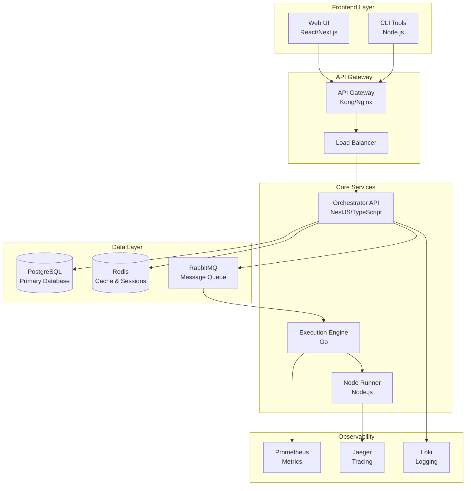

## Core Components

### Orchestrator API

**Technology**: NestJS with TypeScript  
**Responsibility**: Main API layer and business logic  
**Port**: 3000

The Orchestrator API serves as the central hub for all workflow operations. It provides RESTful endpoints for managing workflows, executions, users, and system configuration.

#### Key Features
- **Workflow Management**: CRUD operations for workflows
- **Execution Control**: Start, stop, and monitor workflow executions
- **User Management**: Authentication, authorization, and user accounts
- **System Configuration**: Platform settings and node registry
- **Real-time Updates**: WebSocket connections for live updates

#### Architecture
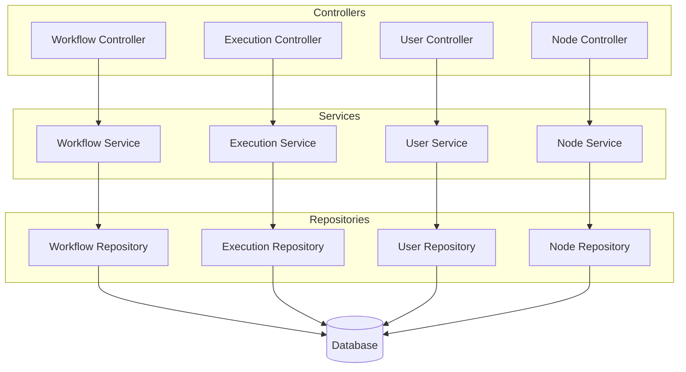

#### Configuration
```typescript
// Configuration example
{
  port: 3000,
  database: {
    host: 'postgres',
    port: 5432,
    database: 'n8n_work',
    username: 'postgres',
    password: 'postgres'
  },
  redis: {
    host: 'redis',
    port: 6379
  },
  rabbitmq: {
    url: 'amqp://rabbitmq:5672'
  },
  jwt: {
    secret: process.env.JWT_SECRET,
    expiresIn: '24h'
  }
}
```

### Execution Engine

**Technology**: Go  
**Responsibility**: Workflow execution orchestration  
**Port**: 8080

The Execution Engine is a high-performance Go service that handles the actual execution of workflows. It receives execution requests from the message queue and coordinates the execution of individual workflow steps.

#### Key Features
- **High Performance**: Written in Go for optimal speed and concurrency
- **Workflow Orchestration**: Manages execution flow and dependencies
- **Error Handling**: Comprehensive error handling and retry logic
- **Metrics Collection**: Performance metrics and execution statistics
- **Resource Management**: Memory and CPU usage optimization

#### Architecture
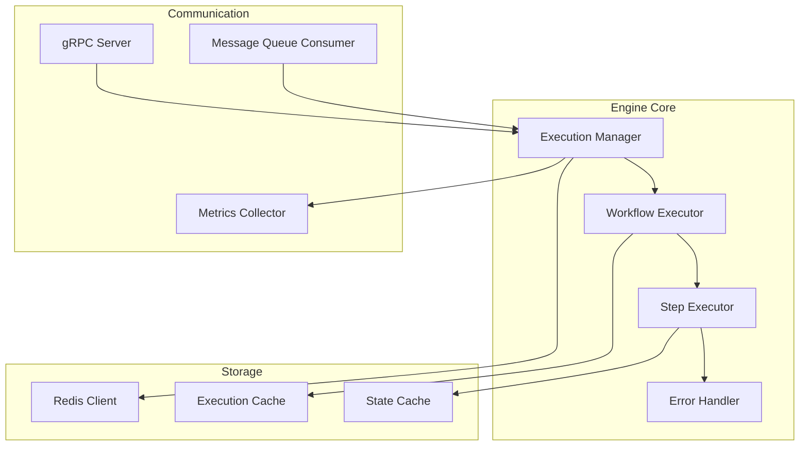

#### Execution Flow
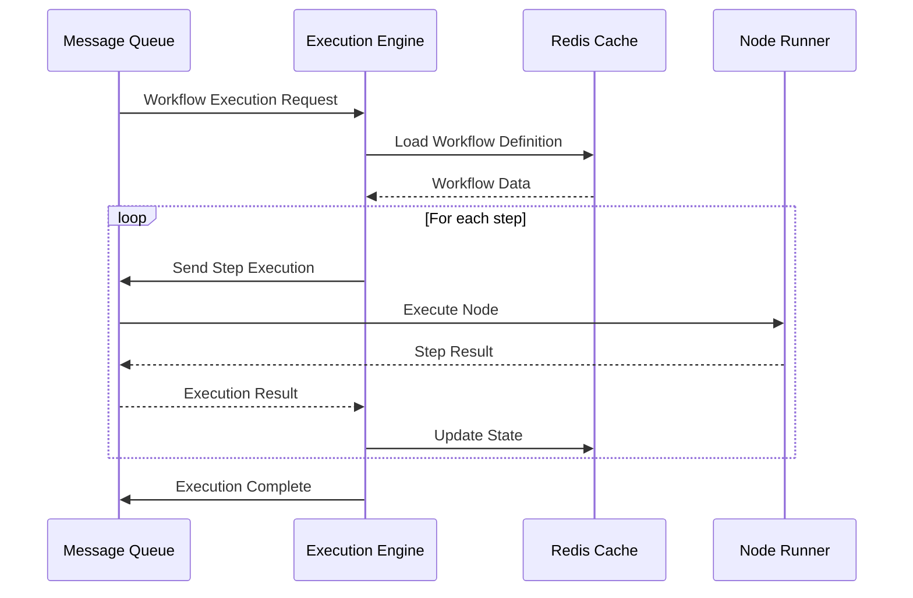

### Node Runner

**Technology**: Node.js with TypeScript  
**Responsibility**: Sandboxed node execution  
**Port**: 3000

The Node Runner provides a secure, sandboxed environment for executing custom nodes. It supports multiple isolation strategies and includes built-in nodes for common operations.

#### Key Features
- **Sandboxed Execution**: Secure isolation using vm2, child processes, or containers
- **Built-in Nodes**: HTTP requests, Slack, webhooks, data transformation
- **Custom Node Support**: Execute user-created nodes via the SDK
- **Resource Limits**: CPU, memory, and network usage controls
- **Monitoring**: Detailed execution metrics and tracing

#### Architecture
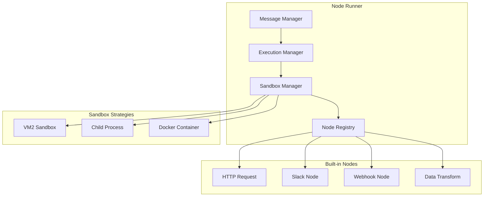

#### Sandbox Configuration
```typescript
// Sandbox configuration options
{
  strategy: 'vm2', // vm2, childprocess, docker
  timeout: 30000,
  memory: 512, // MB
  allowedModules: ['crypto', 'url', 'querystring'],
  networkAccess: true,
  fileSystemAccess: false
}
```

## Data Layer Components

### PostgreSQL Database

**Technology**: PostgreSQL 14+  
**Responsibility**: Primary data storage  
**Port**: 5432

The primary database stores all persistent data including workflows, executions, users, and system configuration.

#### Schema Overview
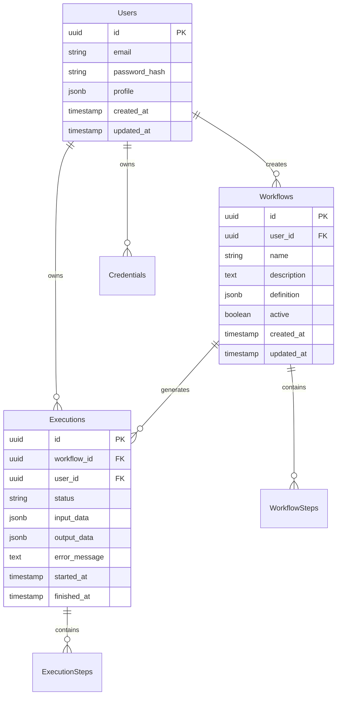

#### Key Tables
- **users**: User accounts and authentication
- **workflows**: Workflow definitions and metadata
- **executions**: Execution history and results
- **workflow_steps**: Individual workflow step definitions
- **execution_steps**: Step-level execution data
- **credentials**: Encrypted credential storage
- **node_types**: Registry of available node types

### Redis Cache

**Technology**: Redis 7+  
**Responsibility**: Caching and session storage  
**Port**: 6379

Redis provides high-performance caching and session management.

#### Usage Patterns
```typescript
// Cache usage examples
{
  // Session storage
  sessions: 'session:user_id:session_token',
  
  // Workflow definitions cache
  workflows: 'workflow:workflow_id',
  
  // Execution state cache
  execution_state: 'execution:execution_id:state',
  
  // Rate limiting
  rate_limits: 'rate_limit:user_id:endpoint',
  
  // Node registry cache
  node_registry: 'nodes:type:version'
}
```

### RabbitMQ Message Queue

**Technology**: RabbitMQ 3.8+  
**Responsibility**: Asynchronous messaging  
**Port**: 5672

RabbitMQ handles all asynchronous communication between components.

#### Queue Structure
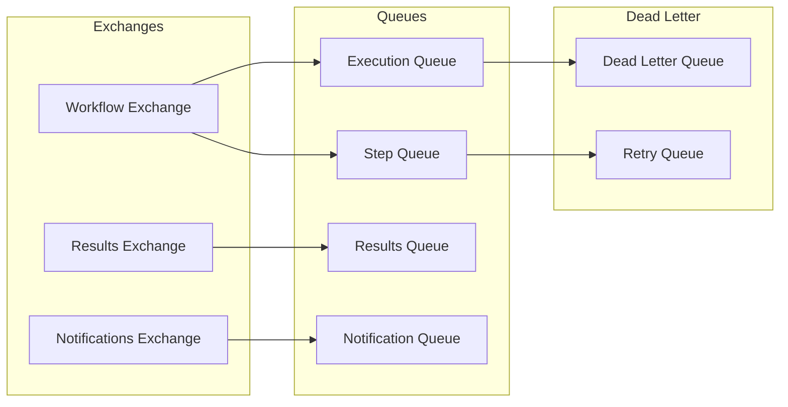

#### Message Types
```typescript
// Message type definitions
interface WorkflowExecutionMessage {
  executionId: string;
  workflowId: string;
  userId: string;
  inputData: any;
  priority: number;
}

interface StepExecutionMessage {
  executionId: string;
  stepId: string;
  nodeType: string;
  parameters: any;
  inputData: any;
}

interface ExecutionResultMessage {
  executionId: string;
  stepId: string;
  success: boolean;
  outputData?: any;
  errorMessage?: string;
}
```

## Observability Components

### Prometheus Metrics

**Technology**: Prometheus  
**Responsibility**: Metrics collection and alerting  
**Port**: 9090

Prometheus collects metrics from all components and provides alerting capabilities.

#### Key Metrics
```yaml
# API metrics
api_requests_total: Counter of API requests
api_request_duration: Histogram of request durations
api_active_connections: Gauge of active connections

# Execution metrics
executions_total: Counter of workflow executions
execution_duration: Histogram of execution times
execution_queue_depth: Gauge of pending executions

# Node runner metrics
nodes_executed_total: Counter of node executions
node_execution_duration: Histogram of node execution times
sandbox_memory_usage: Gauge of sandbox memory usage

# System metrics
system_cpu_usage: Gauge of CPU usage
system_memory_usage: Gauge of memory usage
database_connections: Gauge of database connections
```

### Jaeger Tracing

**Technology**: Jaeger  
**Responsibility**: Distributed tracing  
**Port**: 16686

Jaeger provides distributed tracing for tracking requests across components.

#### Trace Structure
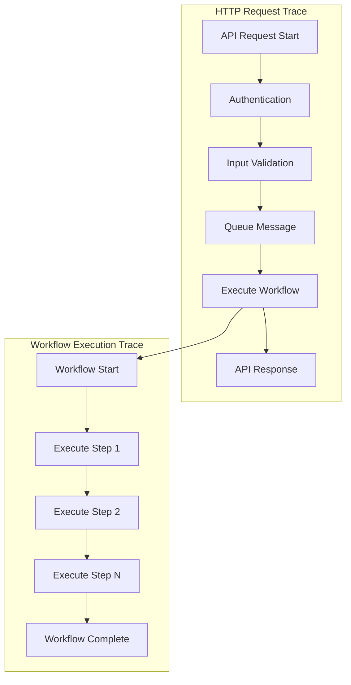

### Loki Logging

**Technology**: Grafana Loki  
**Responsibility**: Log aggregation and analysis  
**Port**: 3100

Loki aggregates logs from all components for centralized analysis.

#### Log Structure
```json
{
  "timestamp": "2023-12-01T10:00:00Z",
  "level": "info",
  "service": "orchestrator-api",
  "trace_id": "abc123",
  "span_id": "def456",
  "user_id": "user123",
  "workflow_id": "workflow456",
  "execution_id": "exec789",
  "message": "Workflow execution started",
  "metadata": {
    "duration_ms": 1500,
    "status": "success"
  }
}
```

## Component Communication

### Internal Communication

Components communicate using various protocols:

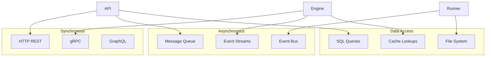

### Service Discovery

Components discover each other through:

- **DNS-based discovery** in Kubernetes
- **Service registry** with Consul
- **Environment variables** for configuration
- **Health checks** for availability

## Deployment Patterns

### Development Environment

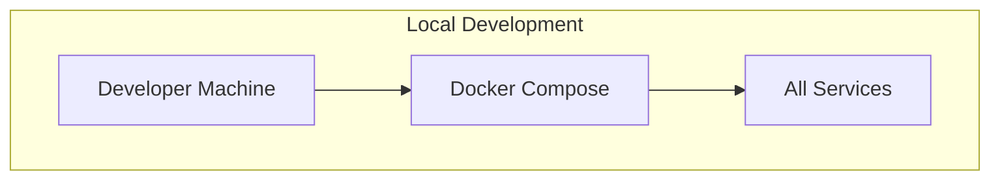

### Production Environment

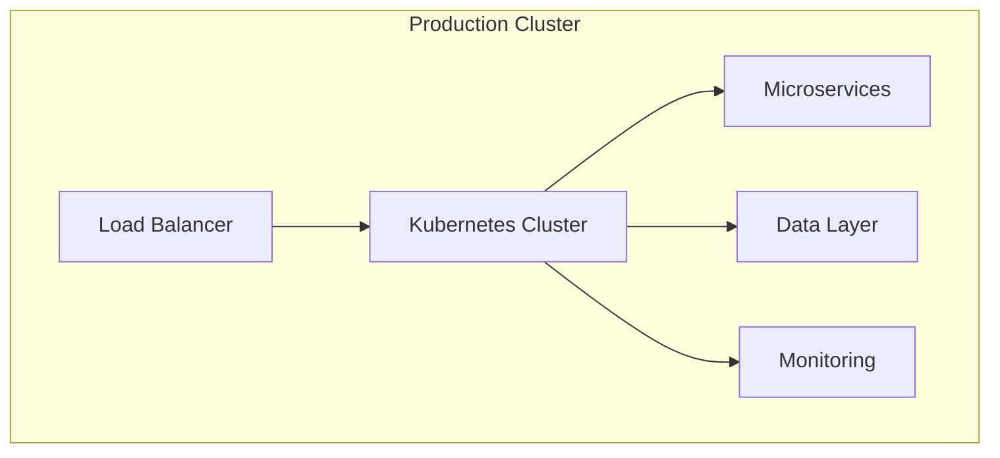

## Resource Requirements

### Minimum Requirements

| Component | CPU | Memory | Storage |
|-----------|-----|--------|---------|
| Orchestrator API | 0.5 cores | 1GB | 10GB |
| Execution Engine | 1 core | 2GB | 5GB |
| Node Runner | 0.5 cores | 1GB | 5GB |
| PostgreSQL | 1 core | 2GB | 50GB |
| Redis | 0.25 cores | 512MB | 5GB |
| RabbitMQ | 0.5 cores | 1GB | 10GB |

### Production Requirements

| Component | CPU | Memory | Storage |
|-----------|-----|--------|---------|
| Orchestrator API | 2-4 cores | 4-8GB | 20GB |
| Execution Engine | 4-8 cores | 8-16GB | 10GB |
| Node Runner | 2-4 cores | 4-8GB | 10GB |
| PostgreSQL | 4-8 cores | 16-32GB | 500GB+ |
| Redis | 1-2 cores | 4-8GB | 20GB |
| RabbitMQ | 2-4 cores | 4-8GB | 50GB |

## Next Steps

Learn more about specific aspects:

- **[Data Flow](/architecture/data-flow)** - How data moves through the system
- **[Security](/architecture/security)** - Security implementation details
- **[Scalability](/architecture/scalability)** - Scaling strategies and patterns
