# Data Flow

Understanding how data moves through the N8N-Work platform is crucial for developers, operators, and anyone working with workflows. This document details the various data flow patterns and how information is processed throughout the system.

## Overview

N8N-Work processes data through several distinct flows:

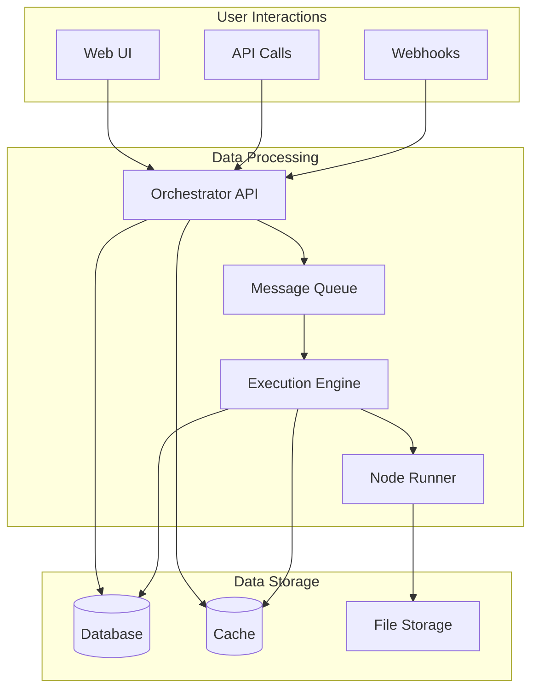

## Core Data Flow Patterns

### 1. Workflow Creation Flow

When a user creates a new workflow, the data follows this path:

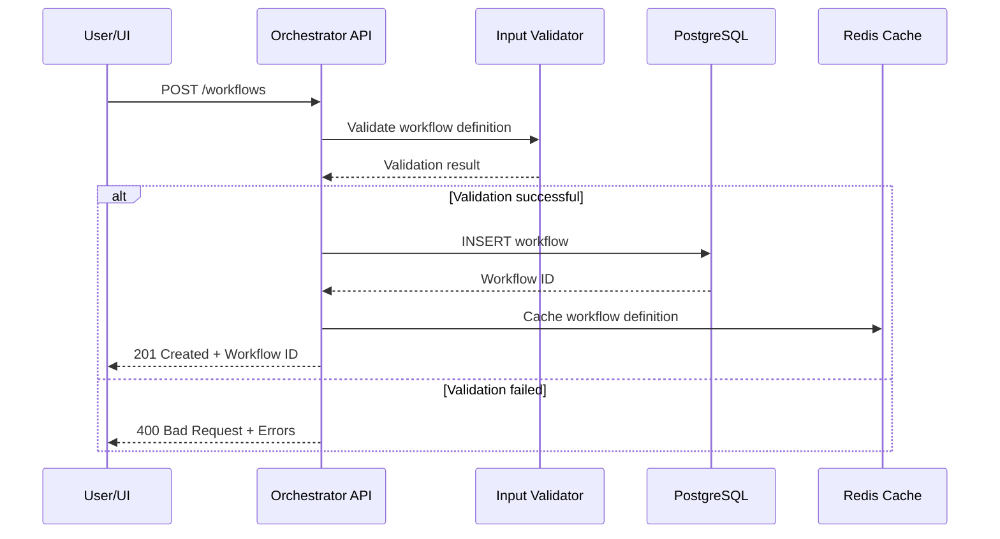

#### Data Transformation
```typescript
// Input from user
interface WorkflowInput {
  name: string;
  description?: string;
  nodes: NodeDefinition[];
  connections: Connection[];
  settings: WorkflowSettings;
}

// Stored in database
interface WorkflowEntity {
  id: string;
  userId: string;
  name: string;
  description: string;
  definition: WorkflowDefinition;
  active: boolean;
  version: number;
  createdAt: Date;
  updatedAt: Date;
}
```

### 2. Workflow Execution Flow

The most complex data flow is workflow execution:

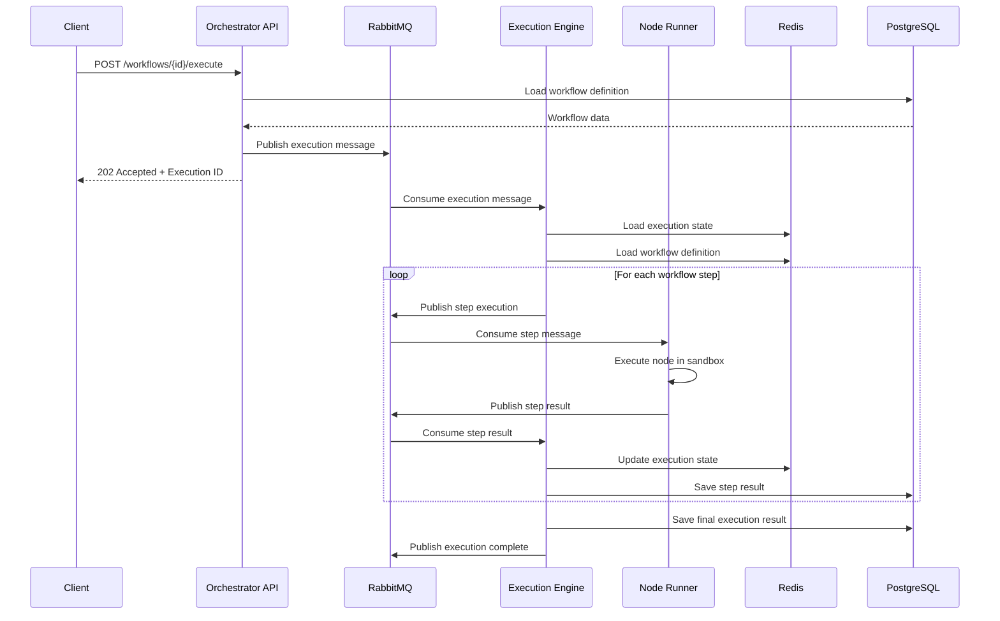

#### Execution Data Structure
```typescript
interface ExecutionMessage {
  executionId: string;
  workflowId: string;
  userId: string;
  triggerData?: any;
  inputData: ExecutionInputData[];
  priority: ExecutionPriority;
  metadata: ExecutionMetadata;
}

interface StepExecutionMessage {
  executionId: string;
  stepId: string;
  nodeType: string;
  parameters: NodeParameters;
  inputData: NodeInputData[];
  context: ExecutionContext;
}

interface StepResultMessage {
  executionId: string;
  stepId: string;
  success: boolean;
  outputData?: NodeOutputData[];
  error?: ExecutionError;
  metrics: StepMetrics;
}
```

### 3. Real-time Data Flow

For real-time updates, N8N-Work uses WebSockets:

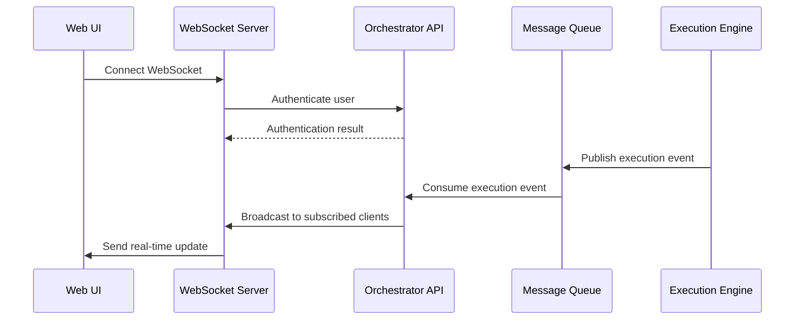

#### WebSocket Message Types
```typescript
interface WebSocketMessage {
  type: 'execution.started' | 'execution.progress' | 'execution.completed' | 'execution.failed';
  payload: {
    executionId: string;
    workflowId: string;
    status: ExecutionStatus;
    progress?: ExecutionProgress;
    result?: ExecutionResult;
    error?: ExecutionError;
  };
  timestamp: string;
}
```

## Data Transformation Patterns

### Input Data Processing

Data enters the system through various channels and needs standardization:

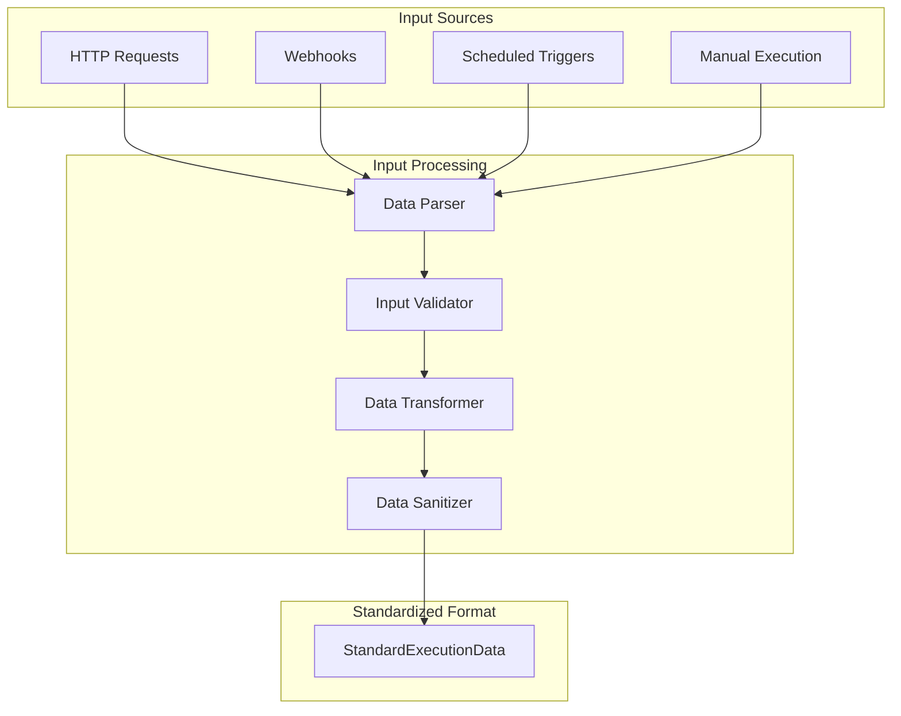

#### Data Standardization
```typescript
// Raw input from various sources
interface RawInputData {
  source: 'http' | 'webhook' | 'schedule' | 'manual';
  headers?: Record<string, string>;
  query?: Record<string, any>;
  body?: any;
  metadata?: Record<string, any>;
}

// Standardized execution data
interface StandardExecutionData {
  json: Record<string, any>;
  binary?: BinaryData;
  metadata: {
    source: string;
    timestamp: string;
    contentType?: string;
    size: number;
  };
}
```

### Node Data Processing

Each node processes data in a standardized way:

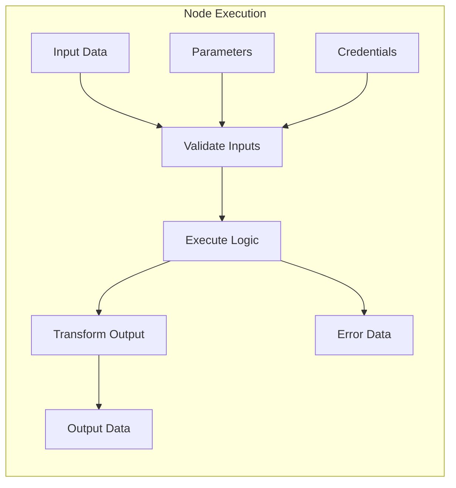

#### Node Processing Pattern
```typescript
interface NodeExecutionContext {
  inputData: NodeInputData[];
  parameters: NodeParameters;
  credentials?: NodeCredentials;
  settings: NodeSettings;
}

interface NodeExecutionResult {
  outputData: NodeOutputData[];
  error?: NodeExecutionError;
  metadata: NodeExecutionMetadata;
}

// Standard node processing function
async function executeNode(
  context: NodeExecutionContext
): Promise<NodeExecutionResult> {
  // 1. Validate inputs
  validateInputData(context.inputData);
  validateParameters(context.parameters);
  
  // 2. Execute node logic
  const result = await nodeLogic(context);
  
  // 3. Transform and validate output
  return transformOutput(result);
}
```

## State Management

### Execution State

Workflow execution state is managed across multiple storage systems:

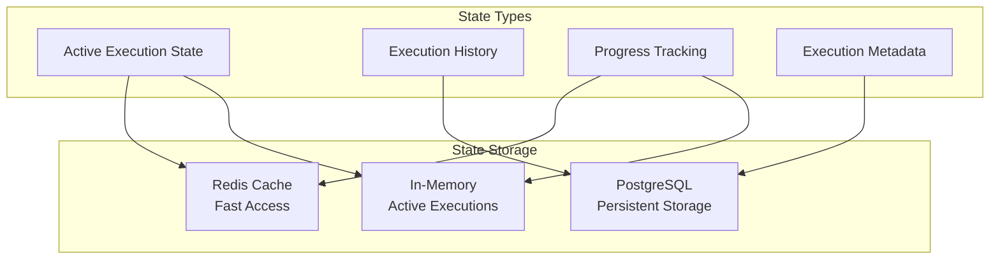

#### State Data Structure
```typescript
interface ExecutionState {
  executionId: string;
  workflowId: string;
  status: 'pending' | 'running' | 'completed' | 'failed' | 'cancelled';
  currentStep?: string;
  completedSteps: string[];
  failedSteps: string[];
  stepData: Record<string, StepExecutionData>;
  startTime: Date;
  endTime?: Date;
  error?: ExecutionError;
}

interface StepExecutionData {
  stepId: string;
  nodeType: string;
  status: 'pending' | 'running' | 'completed' | 'failed';
  inputData: any[];
  outputData?: any[];
  error?: StepExecutionError;
  startTime: Date;
  endTime?: Date;
  metrics: StepMetrics;
}
```

### Caching Strategy

N8N-Work uses a multi-level caching strategy:

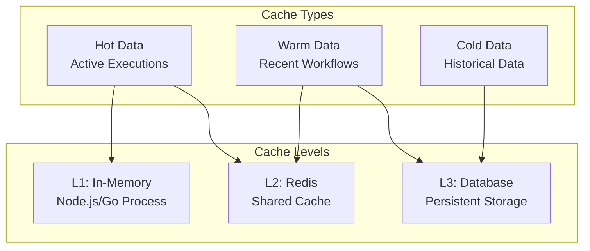

#### Cache Configuration
```typescript
interface CacheConfig {
  levels: {
    l1: {
      maxSize: string; // '100MB'
      ttl: string; // '5m'
      strategy: 'LRU' | 'LFU';
    };
    l2: {
      maxSize: string; // '1GB'
      ttl: string; // '1h'
      keyPrefix: string;
    };
    l3: {
      connectionPool: number;
      queryTimeout: string;
    };
  };
}
```

## Message Queue Data Flow

### Queue Organization

RabbitMQ organizes data flow through exchanges and queues:

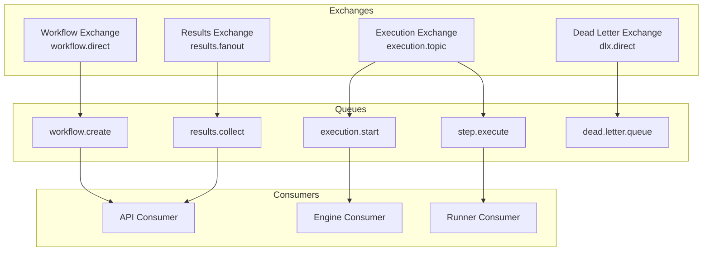

### Message Structure

All messages follow a standardized format:

```typescript
interface BaseMessage {
  id: string;
  type: string;
  timestamp: string;
  correlationId: string;
  userId?: string;
  priority: number;
  retryCount: number;
  maxRetries: number;
}

interface WorkflowExecutionMessage extends BaseMessage {
  type: 'workflow.execute';
  payload: {
    workflowId: string;
    inputData: any;
    triggerData?: any;
    settings?: ExecutionSettings;
  };
}

interface StepExecutionMessage extends BaseMessage {
  type: 'step.execute';
  payload: {
    executionId: string;
    stepId: string;
    nodeType: string;
    parameters: any;
    inputData: any[];
    context: ExecutionContext;
  };
}
```

## Error Data Flow

Error handling involves multiple layers:

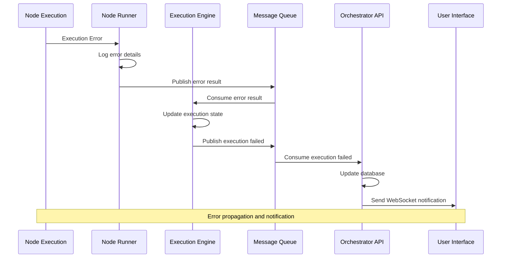

### Error Data Structure

```typescript
interface ExecutionError {
  code: string;
  message: string;
  details?: any;
  stack?: string;
  context: {
    executionId: string;
    stepId?: string;
    nodeType?: string;
    timestamp: string;
    userId?: string;
  };
  classification: 'user' | 'system' | 'network' | 'timeout' | 'resource';
  retryable: boolean;
  metadata?: Record<string, any>;
}

interface ErrorResponse {
  error: ExecutionError;
  execution: {
    id: string;
    status: 'failed';
    failedAt: string;
    partialResults?: any[];
  };
  recovery: {
    canRetry: boolean;
    retryAfter?: string;
    suggestions: string[];
  };
}
```

## Data Security and Privacy

### Data Encryption

Sensitive data is encrypted at multiple points:

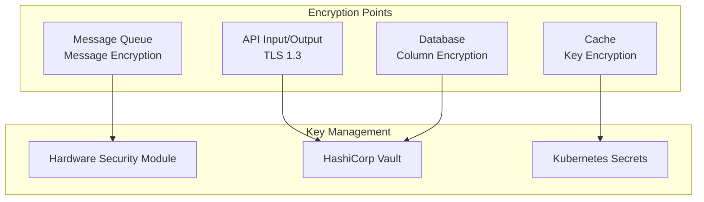

### Data Classification

```typescript
enum DataClassification {
  PUBLIC = 'public',
  INTERNAL = 'internal',
  CONFIDENTIAL = 'confidential',
  RESTRICTED = 'restricted'
}

interface ClassifiedData {
  classification: DataClassification;
  data: any;
  encryption: {
    algorithm: string;
    keyId: string;
    iv?: string;
  };
  access: {
    roles: string[];
    permissions: string[];
  };
  audit: {
    created: string;
    accessed: string[];
    modified: string[];
  };
}
```

## Performance Optimization

### Data Flow Optimization

Several techniques optimize data flow performance:

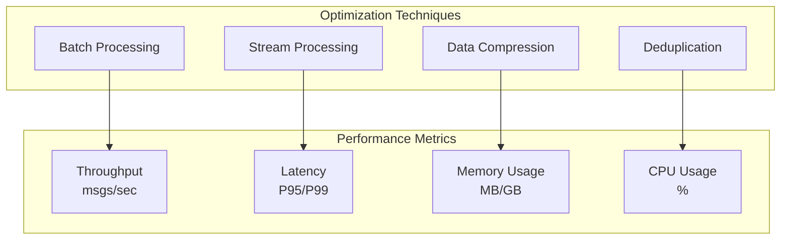

### Batching Strategy

```typescript
interface BatchConfig {
  maxSize: number; // Maximum messages per batch
  maxWait: number; // Maximum wait time in ms
  strategy: 'size' | 'time' | 'adaptive';
}

interface BatchProcessor {
  config: BatchConfig;
  buffer: Message[];
  timer?: NodeJS.Timeout;
  
  add(message: Message): void;
  flush(): Promise<void>;
  process(batch: Message[]): Promise<void>;
}
```

## Monitoring and Observability

### Data Flow Metrics

Key metrics for monitoring data flow:

```typescript
interface DataFlowMetrics {
  throughput: {
    apiRequests: number; // requests/second
    queueMessages: number; // messages/second
    executions: number; // executions/minute
  };
  latency: {
    apiResponse: number; // milliseconds P95
    queueProcessing: number; // milliseconds P95
    executionTime: number; // seconds P95
  };
  errors: {
    apiErrors: number; // errors/minute
    executionFailures: number; // failures/minute
    queueDeadLetters: number; // messages/minute
  };
  resources: {
    cpuUsage: number; // percentage
    memoryUsage: number; // percentage
    diskUsage: number; // percentage
    networkIO: number; // bytes/second
  };
}
```

### Tracing Data Flow

Distributed tracing tracks data through the entire system:

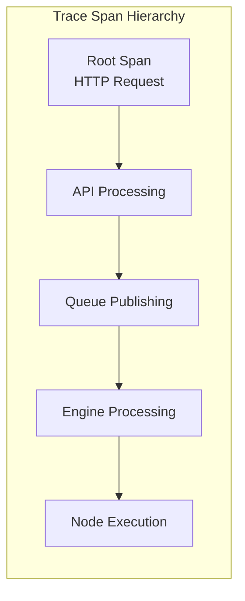

## Next Steps

Learn more about related topics:

- **[Security Architecture](/architecture/security)** - How data is secured throughout the system
- **[Scalability Patterns](/architecture/scalability)** - How data flow scales with load
- **[API Documentation](/api/)** - Detailed API specifications and data formats
