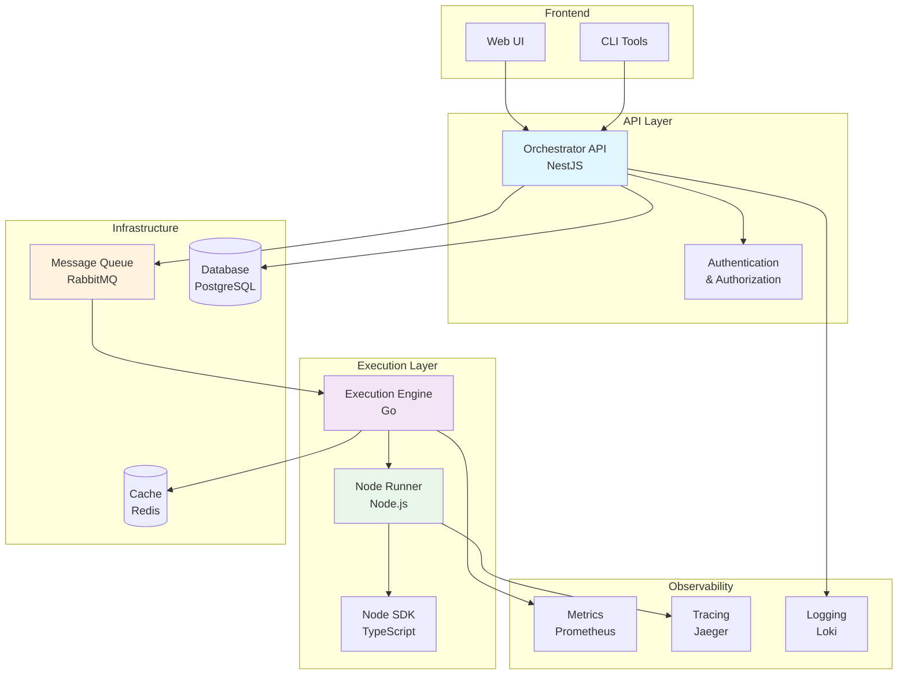
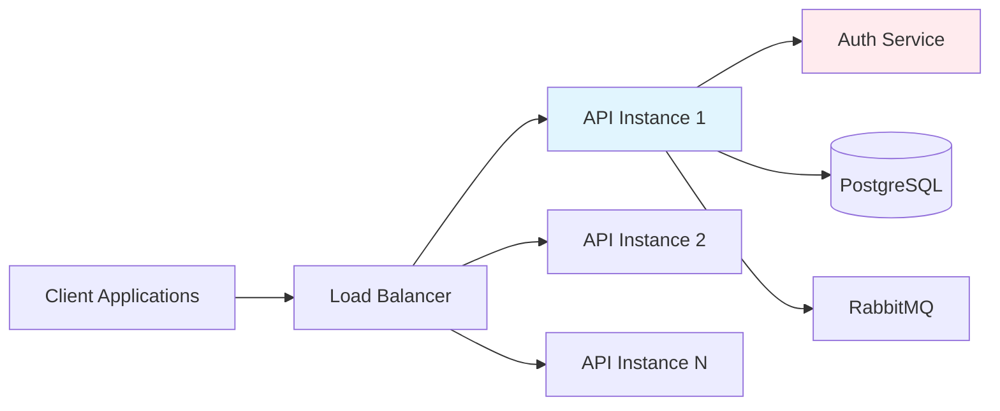
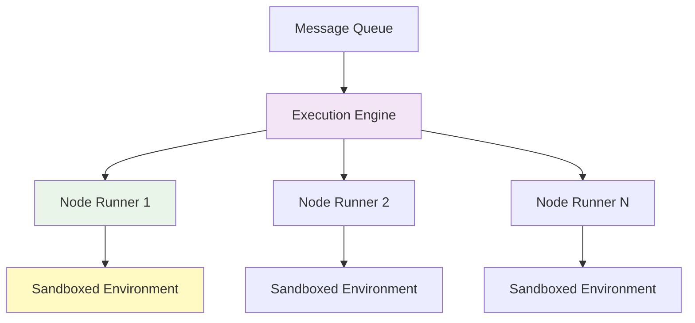
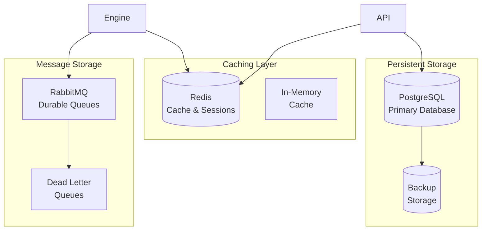
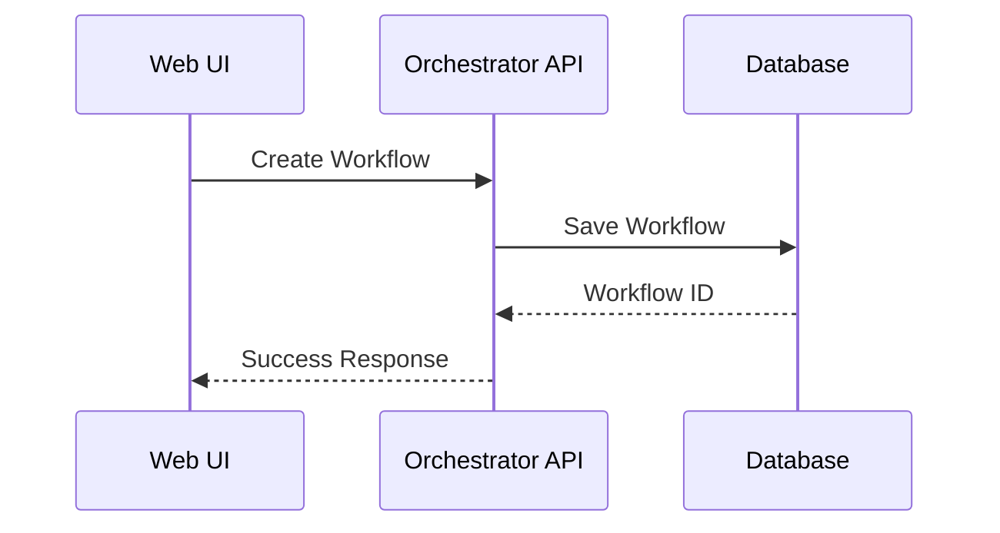
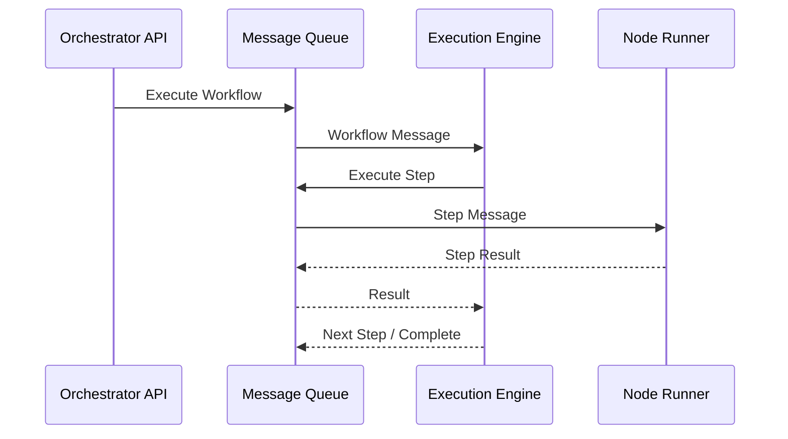
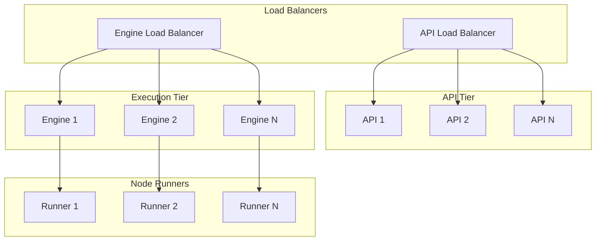
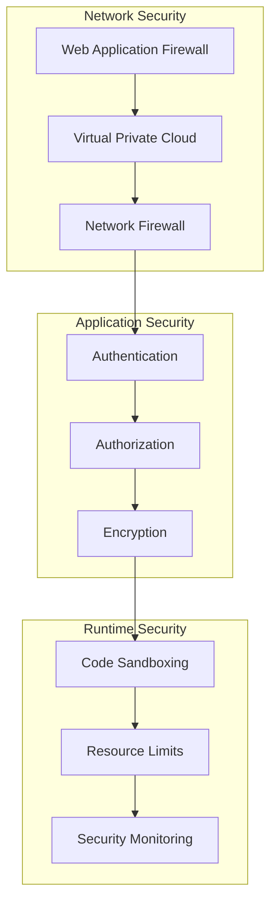

# Platform Architecture

N8N-Work is built as a modern, cloud-native platform using microservices architecture. This design ensures scalability, maintainability, and flexibility while providing robust workflow automation capabilities.

## Overview

The platform consists of several key components that work together to provide a complete workflow automation solution:



## Core Principles

### 🏗️ **Microservices Architecture**
Each component has a single responsibility and can be scaled independently. This allows for:
- **Independent deployment** of components
- **Technology diversity** (Go for performance, Node.js for flexibility)
- **Fault isolation** to prevent cascading failures
- **Team autonomy** for component development

### ⚡ **Asynchronous Processing**
Workflows execute asynchronously using message queues, providing:
- **Non-blocking** API responses
- **Reliable delivery** with message persistence
- **Load balancing** across multiple execution engines
- **Retry mechanisms** for failed operations

### 🔄 **Event-Driven Design**
Components communicate through events and messages:
- **Loose coupling** between services
- **Scalable communication** patterns
- **Easy integration** of new components
- **Audit trail** of all operations

### 🛡️ **Security First**
Security is built into every layer:
- **Authentication** and authorization at the API layer
- **Sandboxed execution** for user code
- **Encrypted communication** between services
- **Audit logging** for compliance

## Component Architecture

### API Layer

The API layer serves as the main interface for all external interactions:



**Key Features:**
- RESTful API with OpenAPI specification
- JWT-based authentication
- Role-based access control (RBAC)
- Rate limiting and throttling
- Input validation and sanitization

### Execution Layer

The execution layer handles workflow processing:



**Key Features:**
- High-performance Go execution engine
- Sandboxed Node.js runtime environments
- Horizontal scaling of node runners
- Resource isolation and limits
- Execution monitoring and metrics

### Data Layer

The data layer provides persistent and temporary storage:



**Key Features:**
- ACID compliance with PostgreSQL
- High-performance caching with Redis
- Durable message queues
- Automated backup and recovery
- Data encryption at rest

## Communication Patterns

### Synchronous Communication

Used for real-time operations and user-facing APIs:



### Asynchronous Communication

Used for workflow execution and background processing:



## Scalability Design

### Horizontal Scaling

All components are designed for horizontal scaling:



### Auto-Scaling

Components can automatically scale based on metrics:

- **API Servers**: Scale based on CPU and request rate
- **Execution Engines**: Scale based on queue depth
- **Node Runners**: Scale based on execution load
- **Database**: Read replicas for scaling reads

## Security Architecture

### Defense in Depth

Multiple layers of security protect the platform:



### Key Security Features

1. **Authentication & Authorization**
   - JWT tokens with refresh mechanism
   - Role-based access control (RBAC)
   - API key management for integrations

2. **Code Isolation**
   - Sandboxed execution environments
   - Resource limits (CPU, memory, network)
   - Restricted module access

3. **Data Protection**
   - Encryption at rest and in transit
   - Secrets management
   - Audit logging

4. **Network Security**
   - VPC isolation
   - TLS termination
   - Rate limiting and DDoS protection

## Deployment Architecture

### Container Orchestration

The platform is designed for Kubernetes deployment:

```mermaid
graph TB
    subgraph "Ingress"
        Ingress[Nginx Ingress]
        Cert[Cert Manager]
    end
    
    subgraph "Application Pods"
        API[API Pods]
        Engine[Engine Pods]
        Runner[Runner Pods]
    end
    
    subgraph "Data Services"
        PG[PostgreSQL]
        Redis[Redis]
        RabbitMQ[RabbitMQ]
    end
    
    subgraph "Monitoring"
        Prometheus[Prometheus]
        Grafana[Grafana]
        Jaeger[Jaeger]
    end
    
    Ingress --> API
    Cert --> Ingress
    API --> PG
    API --> Redis
    API --> RabbitMQ
    Engine --> RabbitMQ
    Runner --> Engine
    
    Prometheus --> API
    Prometheus --> Engine
    Grafana --> Prometheus
    Jaeger --> API
```

### Infrastructure as Code

All infrastructure is managed as code:

- **Kubernetes manifests** for container orchestration
- **Helm charts** for application packaging
- **Terraform** for cloud infrastructure
- **GitOps** for deployment automation

## Performance Characteristics

### Throughput

Expected performance characteristics:

| Component | Metric | Target |
|-----------|--------|--------|
| API | Requests/sec | 10,000+ |
| Execution Engine | Workflows/sec | 1,000+ |
| Node Runner | Nodes/sec | 5,000+ |
| Database | Queries/sec | 50,000+ |

### Latency

Response time targets:

| Operation | Target Latency | Max Latency |
|-----------|---------------|-------------|
| API Response | < 100ms | < 500ms |
| Workflow Start | < 200ms | < 1s |
| Node Execution | < 500ms | < 5s |
| Database Query | < 10ms | < 100ms |

### Scalability Limits

Theoretical scaling limits:

- **Concurrent Workflows**: 100,000+
- **Daily Executions**: 10 million+
- **Stored Workflows**: 1 million+
- **Active Users**: 100,000+

## Next Steps

Learn more about specific components:

- **[Components Overview](/architecture/components)** - Detailed component descriptions
- **[Data Flow](/architecture/data-flow)** - How data moves through the system
- **[Security](/architecture/security)** - Security implementation details
- **[Scalability](/architecture/scalability)** - Scaling strategies and limits
