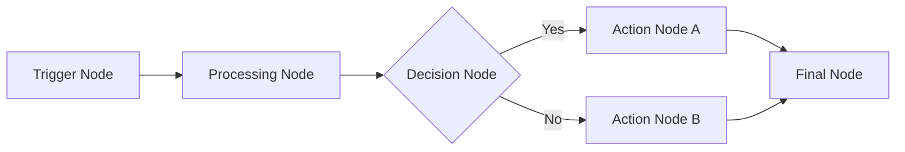

# Creating Workflows

Learn how to design, build, and deploy workflows using the N8N-Work platform. This guide covers everything from basic concepts to advanced workflow patterns.

## What is a Workflow?

A workflow is a sequence of connected nodes that automate business processes by transforming, routing, and processing data. Each workflow defines:

- **Nodes**: Individual processing units that perform specific tasks
- **Connections**: Data flow paths between nodes
- **Triggers**: Events that initiate workflow execution
- **Data**: Information passed between nodes during execution

## Workflow Anatomy



### Core Components

1. **Trigger Nodes**: Start the workflow (webhooks, schedules, file watchers)
2. **Processing Nodes**: Transform and manipulate data
3. **Decision Nodes**: Route data based on conditions
4. **Action Nodes**: Perform external operations (API calls, database operations)
5. **Utility Nodes**: Helper functions (delay, merge, split)

## Creating Your First Workflow

### Step 1: Design the Workflow

Before building, plan your workflow:

```typescript
// Example: GitHub Issue to Slack Notification
const workflowPlan = {
  trigger: 'GitHub webhook',
  steps: [
    'Receive GitHub webhook',
    'Filter for new issues',
    'Format message',
    'Send to Slack'
  ],
  outputs: ['Slack notification', 'Database log']
};
```

### Step 2: Set Up the Trigger

```typescript
// Webhook trigger configuration
const webhookTrigger = {
  id: 'github_webhook',
  type: 'webhook',
  name: 'GitHub Webhook',
  parameters: {
    path: 'github-issues',
    httpMethod: 'POST',
    authentication: 'secret',
    secret: 'your-webhook-secret'
  },
  position: [100, 100]
};
```

### Step 3: Add Processing Nodes

```typescript
// Filter node for new issues
const filterNode = {
  id: 'filter_issues',
  type: 'if',
  name: 'Filter New Issues',
  parameters: {
    condition: '={{$json.action}} === "opened"',
    falseOutput: false
  },
  position: [300, 100]
};

// Data transformation node
const transformNode = {
  id: 'format_message',
  type: 'function',
  name: 'Format Slack Message',
  parameters: {
    code: `
      const issue = $input.first().json;
      return [{
        json: {
          channel: '#dev-alerts',
          text: \`New issue: \${issue.title}\`,
          attachments: [{
            color: 'warning',
            fields: [
              { title: 'Repository', value: issue.repository.name, short: true },
              { title: 'Author', value: issue.user.login, short: true },
              { title: 'Labels', value: issue.labels.map(l => l.name).join(', '), short: false }
            ]
          }]
        }
      }];
    `
  },
  position: [500, 100]
};
```

### Step 4: Add Action Nodes

```typescript
// Slack notification node
const slackNode = {
  id: 'slack_notification',
  type: 'slack',
  name: 'Send Slack Notification',
  parameters: {
    authentication: 'slackApi',
    channel: '={{$json.channel}}',
    text: '={{$json.text}}',
    attachments: '={{$json.attachments}}'
  },
  position: [700, 100]
};

// Database logging node
const dbLogNode = {
  id: 'log_to_db',
  type: 'postgres',
  name: 'Log to Database',
  parameters: {
    authentication: 'postgresCredentials',
    operation: 'insert',
    schema: 'public',
    table: 'workflow_logs',
    columns: 'workflow_id,execution_id,event_type,data',
    additionalFields: {
      workflow_id: 'github-to-slack',
      execution_id: '={{$execution.id}}',
      event_type: 'github_issue_created',
      data: '={{JSON.stringify($json)}}'
    }
  },
  position: [700, 200]
};
```

### Step 5: Connect the Nodes

```typescript
const connections = [
  {
    from: 'github_webhook',
    to: 'filter_issues',
    fromOutput: 'main',
    toInput: 'main'
  },
  {
    from: 'filter_issues', 
    to: 'format_message',
    fromOutput: 'true',
    toInput: 'main'
  },
  {
    from: 'format_message',
    to: 'slack_notification',
    fromOutput: 'main',
    toInput: 'main'
  },
  {
    from: 'format_message',
    to: 'log_to_db',
    fromOutput: 'main',
    toInput: 'main'
  }
];
```

### Step 6: Complete Workflow Definition

```typescript
const workflow = {
  name: 'GitHub Issues to Slack',
  description: 'Automatically notify Slack when new GitHub issues are created',
  definition: {
    nodes: [
      webhookTrigger,
      filterNode,
      transformNode,
      slackNode,
      dbLogNode
    ],
    connections: connections,
    settings: {
      timezone: 'UTC',
      saveDataErrorExecution: 'all',
      saveDataSuccessExecution: 'none',
      executionTimeout: 300
    }
  },
  active: true,
  tags: ['github', 'slack', 'notifications']
};
```

## Advanced Workflow Patterns

### 1. Parallel Processing

```typescript
// Split data for parallel processing
const splitNode = {
  id: 'split_data',
  type: 'itemList',
  name: 'Split Items',
  parameters: {
    fieldName: 'items'
  }
};

// Merge results back together
const mergeNode = {
  id: 'merge_results',
  type: 'merge',
  name: 'Merge Results',
  parameters: {
    mode: 'waitForAll',
    output: 'input1'
  }
};
```

### 2. Error Handling

```typescript
const errorHandlerNode = {
  id: 'error_handler',
  type: 'function',
  name: 'Handle Errors',
  parameters: {
    code: `
      if ($input.first().json.error) {
        // Log error
        console.error('Workflow error:', $input.first().json.error);
        
        // Send alert
        return [{
          json: {
            alert: true,
            message: 'Workflow failed: ' + $input.first().json.error,
            severity: 'high'
          }
        }];
      }
      
      return $input.all();
    `,
    onError: 'continueRegularOutput'
  }
};
```

### 3. Conditional Branching

```typescript
const conditionalNode = {
  id: 'priority_router',
  type: 'switch',
  name: 'Route by Priority',
  parameters: {
    dataType: 'string',
    value1: '={{$json.priority}}',
    rules: {
      values: [
        { value: 'high', output: 0 },
        { value: 'medium', output: 1 },
        { value: 'low', output: 2 }
      ]
    }
  }
};
```

### 4. Data Transformation

```typescript
const transformDataNode = {
  id: 'transform_data',
  type: 'set',
  name: 'Transform Data',
  parameters: {
    assignments: {
      values: [
        { name: 'id', value: '={{$json.original_id}}' },
        { name: 'name', value: '={{$json.first_name}} {{$json.last_name}}' },
        { name: 'email', value: '={{$json.email_address.toLowerCase()}}' },
        { name: 'created_at', value: '={{new Date().toISOString()}}' },
        { name: 'tags', value: '={{$json.categories.split(",").map(c => c.trim())}}' }
      ]
    },
    includeOtherFields: false
  }
};
```

## Working with Data

### Data Context

Every node receives data from previous nodes through the data context:

```typescript
// Available data contexts
const dataContexts = {
  $json: 'Current item JSON data',
  $binary: 'Current item binary data', 
  $input: 'All input data',
  $node: 'Current node information',
  $workflow: 'Workflow metadata',
  $execution: 'Execution information',
  $env: 'Environment variables',
  $now: 'Current timestamp',
  $today: 'Today\'s date'
};
```

### Data Expressions

Use expressions to access and manipulate data:

```typescript
// Simple expressions
'={{$json.user_id}}'                    // Get user ID
'={{$json.first_name + " " + $json.last_name}}'  // Concatenate names
'={{$json.price * 1.1}}'               // Calculate with tax

// Complex expressions
'={{$json.items.filter(item => item.active).length}}'  // Count active items
'={{new Date($json.created_at).toLocaleDateString()}}' // Format date
'={{$json.tags.includes("urgent") ? "high" : "normal"}}' // Conditional logic
```

### Working with Arrays

```typescript
// Process array data
const arrayProcessing = {
  // Map over items
  transformItems: '={{$json.items.map(item => ({...item, processed: true}))}}',
  
  // Filter items
  filterActive: '={{$json.items.filter(item => item.status === "active")}}',
  
  // Reduce to sum
  calculateTotal: '={{$json.items.reduce((sum, item) => sum + item.price, 0)}}',
  
  // Find specific item
  findUser: '={{$json.users.find(user => user.id === $json.target_user_id)}}'
};
```

## Testing Workflows

### 1. Unit Testing Individual Nodes

```typescript
// Test data for webhook node
const testWebhookData = {
  headers: {
    'x-github-event': 'issues',
    'x-github-delivery': 'test-123'
  },
  body: {
    action: 'opened',
    issue: {
      id: 123,
      title: 'Test Issue',
      body: 'This is a test issue',
      user: { login: 'testuser' },
      labels: [{ name: 'bug' }]
    },
    repository: {
      name: 'test-repo',
      full_name: 'user/test-repo'
    }
  }
};

// Test the filter node
const testFilter = (data) => {
  const condition = data.action === 'opened';
  console.log('Filter test:', condition ? 'PASS' : 'FAIL');
  return condition;
};
```

### 2. Integration Testing

```typescript
// Full workflow test
const testWorkflow = async () => {
  const client = new N8NWorkClient({ accessToken: 'test-token' });
  
  // Execute workflow with test data
  const execution = await client.workflows.execute('wf_test_workflow', {
    inputData: testWebhookData
  });
  
  // Wait for completion
  const result = await client.executions.waitForCompletion(execution.executionId);
  
  // Verify results
  assert(result.status === 'success', 'Workflow should complete successfully');
  assert(result.outputData.slack_sent === true, 'Slack notification should be sent');
  
  console.log('Integration test: PASS');
};
```

### 3. Load Testing

```bash
# Load test with multiple concurrent executions
for i in {1..100}; do
  curl -X POST "https://api.n8n-work.com/v1/workflows/wf_test/execute" \
    -H "Authorization: Bearer $TOKEN" \
    -H "Content-Type: application/json" \
    -d '{"inputData": {"test_id": '$i'}}' &
done
wait
```

## Performance Optimization

### 1. Node Optimization

```typescript
// Inefficient: Multiple API calls in loop
const inefficientNode = {
  code: `
    const results = [];
    for (const item of $input.all()) {
      const response = await fetch(\`/api/users/\${item.json.user_id}\`);
      results.push(await response.json());
    }
    return results.map(r => ({ json: r }));
  `
};

// Efficient: Batch API call
const efficientNode = {
  code: `
    const userIds = $input.all().map(item => item.json.user_id);
    const response = await fetch('/api/users/batch', {
      method: 'POST',
      body: JSON.stringify({ ids: userIds })
    });
    const users = await response.json();
    return users.map(user => ({ json: user }));
  `
};
```

### 2. Memory Management

```typescript
// Process large datasets in chunks
const batchProcessingNode = {
  code: `
    const BATCH_SIZE = 100;
    const items = $input.all();
    const results = [];
    
    for (let i = 0; i < items.length; i += BATCH_SIZE) {
      const batch = items.slice(i, i + BATCH_SIZE);
      const batchResults = await processBatch(batch);
      results.push(...batchResults);
      
      // Allow garbage collection between batches
      if (i % (BATCH_SIZE * 10) === 0) {
        await new Promise(resolve => setTimeout(resolve, 10));
      }
    }
    
    return results.map(r => ({ json: r }));
  `
};
```

### 3. Caching Strategies

```typescript
// Cache frequently accessed data
const cacheNode = {
  code: `
    const cache = $workflow.getCache();
    const cacheKey = 'user_data_' + $json.user_id;
    
    // Check cache first
    let userData = await cache.get(cacheKey);
    
    if (!userData) {
      // Fetch from API if not cached
      const response = await fetch(\`/api/users/\${$json.user_id}\`);
      userData = await response.json();
      
      // Cache for 1 hour
      await cache.set(cacheKey, userData, 3600);
    }
    
    return [{ json: { ...userData, cached: !userData } }];
  `
};
```

## Debugging Workflows

### 1. Enable Detailed Logging

```typescript
const debugNode = {
  id: 'debug_data',
  type: 'function',
  name: 'Debug Data Flow',
  parameters: {
    code: `
      console.log('Node execution:', {
        nodeId: $node.id,
        inputCount: $input.all().length,
        inputData: $input.all().slice(0, 3), // First 3 items
        timestamp: new Date().toISOString()
      });
      
      // Pass data through unchanged
      return $input.all();
    `
  }
};
```

### 2. Data Validation

```typescript
const validationNode = {
  code: `
    const validate = (data, schema) => {
      const errors = [];
      
      for (const [field, rules] of Object.entries(schema)) {
        const value = data[field];
        
        if (rules.required && (value === undefined || value === null)) {
          errors.push(\`Field '\${field}' is required\`);
        }
        
        if (rules.type && typeof value !== rules.type) {
          errors.push(\`Field '\${field}' must be of type \${rules.type}\`);
        }
        
        if (rules.pattern && !rules.pattern.test(value)) {
          errors.push(\`Field '\${field}' format is invalid\`);
        }
      }
      
      return errors;
    };
    
    const schema = {
      email: { required: true, type: 'string', pattern: /^[^@]+@[^@]+\\.[^@]+$/ },
      age: { required: true, type: 'number' }
    };
    
    const results = [];
    
    for (const item of $input.all()) {
      const errors = validate(item.json, schema);
      
      if (errors.length > 0) {
        console.error('Validation errors:', errors);
        results.push({
          json: { ...item.json, _validation_errors: errors }
        });
      } else {
        results.push(item);
      }
    }
    
    return results;
  `
};
```

### 3. Error Recovery

```typescript
const errorRecoveryNode = {
  code: `
    try {
      // Risky operation
      const result = await riskyApiCall($json);
      return [{ json: result }];
      
    } catch (error) {
      console.error('Operation failed:', error);
      
      // Implement fallback strategy
      if (error.code === 'RATE_LIMIT') {
        // Wait and retry
        await new Promise(resolve => setTimeout(resolve, 5000));
        return await retryOperation();
        
      } else if (error.code === 'NOT_FOUND') {
        // Use default data
        return [{ json: getDefaultData() }];
        
      } else {
        // Log and continue with empty result
        await logError(error);
        return [{ json: { error: true, message: error.message } }];
      }
    }
  `
};
```

## Best Practices

### 1. Workflow Design

- **Single Responsibility**: Each workflow should have one clear purpose
- **Modular Design**: Break complex workflows into smaller, reusable components
- **Error Handling**: Always include error handling and recovery mechanisms
- **Documentation**: Add clear descriptions and comments to nodes

### 2. Data Management

- **Validation**: Validate input data at workflow entry points
- **Transformation**: Keep data transformations simple and predictable
- **Size Limits**: Consider memory usage with large datasets
- **Cleanup**: Remove unnecessary data fields early in the pipeline

### 3. Security

- **Credential Management**: Use secure credential storage, never hardcode secrets
- **Input Sanitization**: Sanitize all external inputs
- **Access Control**: Implement proper authentication and authorization
- **Audit Logging**: Log all workflow executions and data access

### 4. Monitoring

- **Health Checks**: Implement workflow health monitoring
- **Metrics**: Track execution times, success rates, and error patterns
- **Alerting**: Set up alerts for failures and performance issues
- **Retention**: Manage execution history and log retention

## Common Patterns

### 1. ETL (Extract, Transform, Load)

```typescript
const etlWorkflow = {
  // Extract: Get data from source
  extract: {
    type: 'httpRequest',
    parameters: {
      url: 'https://api.source.com/data',
      method: 'GET'
    }
  },
  
  // Transform: Clean and format data
  transform: {
    type: 'function',
    parameters: {
      code: `
        return $input.all().map(item => ({
          json: {
            id: item.json.id,
            name: item.json.full_name.trim(),
            email: item.json.email_address.toLowerCase(),
            created_at: new Date(item.json.created).toISOString()
          }
        }));
      `
    }
  },
  
  // Load: Save to destination
  load: {
    type: 'postgres',
    parameters: {
      operation: 'insert',
      table: 'users',
      onConflict: 'update'
    }
  }
};
```

### 2. Event-Driven Processing

```typescript
const eventWorkflow = {
  // Listen for events
  trigger: {
    type: 'webhook',
    parameters: { path: 'events' }
  },
  
  // Route by event type
  router: {
    type: 'switch',
    parameters: {
      value1: '={{$json.event_type}}',
      rules: {
        values: [
          { value: 'user.created', output: 0 },
          { value: 'user.updated', output: 1 },
          { value: 'user.deleted', output: 2 }
        ]
      }
    }
  },
  
  // Process each event type differently
  handlers: {
    created: { type: 'function', /* ... */ },
    updated: { type: 'function', /* ... */ },
    deleted: { type: 'function', /* ... */ }
  }
};
```

### 3. Batch Processing

```typescript
const batchWorkflow = {
  // Scheduled trigger
  trigger: {
    type: 'cron',
    parameters: {
      schedule: '0 2 * * *' // Daily at 2 AM
    }
  },
  
  // Get batch of items to process
  getBatch: {
    type: 'postgres',
    parameters: {
      operation: 'select',
      query: 'SELECT * FROM pending_items LIMIT 1000'
    }
  },
  
  // Process in parallel
  process: {
    type: 'splitInBatches',
    parameters: { batchSize: 50 }
  },
  
  // Handle each batch
  handleBatch: {
    type: 'function',
    parameters: {
      code: 'return await processBatch($input.all());'
    }
  }
};
```

## Next Steps

- **[Node Development](/guide/node-development)** - Learn to create custom nodes
- **[Deployment Guide](/guide/deployment)** - Deploy workflows to production
- **[API Integration](/api/index)** - Integrate with external systems
- **[Monitoring](/guide/monitoring)** - Monitor workflow performance
