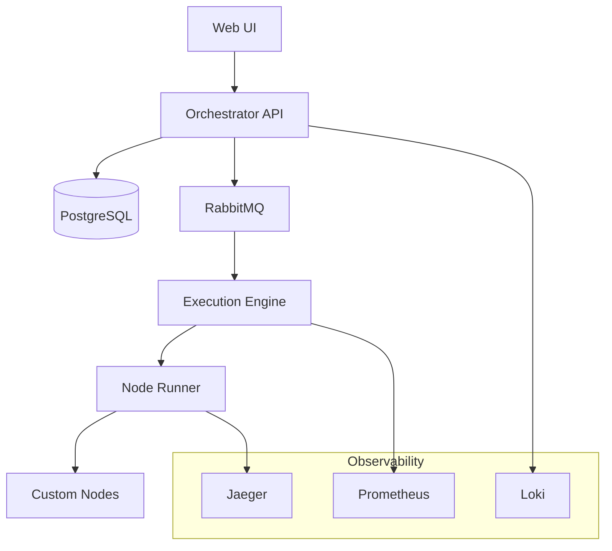

# Introduction

Welcome to N8N-Work, a modern, developer-first workflow automation platform designed to handle complex automation scenarios with ease and scalability.

## What is N8N-Work?

N8N-Work is an open-source workflow automation platform that enables you to connect various services, APIs, and systems together through visual workflows. Unlike traditional automation tools, N8N-Work is built from the ground up with developers in mind, offering:

- **TypeScript-first development** with full type safety
- **Microservices architecture** for scalability and maintainability  
- **Comprehensive APIs** (REST and gRPC) for integration
- **Powerful SDK** for building custom nodes and integrations
- **Enterprise-grade** security, monitoring, and deployment options

## Key Features

### 🎯 **Developer Experience**
- Full TypeScript support across the entire platform
- Rich CLI tools for development and deployment
- Comprehensive API documentation with interactive examples
- Hot reloading and debugging capabilities

### 🏗️ **Scalable Architecture**
- Microservices-based design with clear separation of concerns
- High-performance Go execution engine for critical operations
- Flexible Node.js runtime for custom logic and integrations
- Message queue-based execution for reliability and scalability

### 🔌 **Extensibility**
- Create custom nodes using our powerful TypeScript SDK
- Plugin system for extending platform capabilities
- Rich ecosystem of community-contributed integrations
- Support for custom runtime environments

### 🛡️ **Enterprise Ready**
- Built-in authentication and authorization
- Comprehensive audit logging and compliance features
- Advanced monitoring and alerting with OpenTelemetry
- Multi-tenant architecture support

## How It Works

N8N-Work operates on three core concepts:

### Workflows
A workflow is a series of connected nodes that define your automation logic. Workflows can be triggered by schedules, webhooks, or manual execution.

```json
{
  "name": "GitHub to Slack Notification",
  "description": "Send Slack notifications for new GitHub issues",
  "trigger": {
    "type": "webhook",
    "settings": {
      "path": "/github-webhook"
    }
  },
  "nodes": [
    {
      "id": "filter",
      "type": "if",
      "settings": {
        "condition": "{{$github.action}} === 'opened'"
      }
    },
    {
      "id": "notify",
      "type": "slack.send-message",
      "settings": {
        "channel": "#dev-alerts",
        "message": "New issue: {{$github.issue.title}}"
      }
    }
  ]
}
```

### Nodes
Nodes are the building blocks of workflows. Each node performs a specific action like making an HTTP request, transforming data, or sending a notification.

### Executions
An execution is a single run of a workflow, containing all the data that flows through the nodes and the results of each step.

## Platform Architecture

N8N-Work consists of several key components working together:



- **Orchestrator API**: RESTful API for managing workflows and executions
- **Execution Engine**: High-performance Go service for workflow execution
- **Node Runner**: Sandboxed Node.js environment for running custom nodes
- **Message Queue**: RabbitMQ for reliable, asynchronous communication
- **Database**: PostgreSQL for persistent data storage
- **Observability**: Comprehensive monitoring with Prometheus, Jaeger, and Loki

## Use Cases

N8N-Work is perfect for a wide range of automation scenarios:

### 🔄 **API Integration**
Connect different services and APIs to create seamless data flows between your tools and systems.

### 📊 **Data Processing**
Transform, validate, and route data between systems with powerful data manipulation capabilities.

### 🚨 **Monitoring & Alerting**
Create sophisticated monitoring workflows that can react to events and send notifications across multiple channels.

### 🤖 **Business Process Automation**
Automate complex business processes involving multiple systems, approvals, and conditional logic.

### 📈 **Analytics & Reporting**
Collect data from various sources, process it, and generate reports or feed it into analytics systems.

## Getting Started

Ready to start building workflows? Here are your next steps:

1. **[Quick Start](/guide/quick-start)** - Get N8N-Work running locally in minutes
2. **[Installation](/guide/installation)** - Detailed installation instructions for different environments
3. **[Core Concepts](/guide/concepts/workflows)** - Learn about workflows, nodes, and executions
4. **[Building Workflows](/guide/workflows/creating)** - Create your first workflow

## Need Help?

- 📖 **Documentation**: You're in the right place! Browse the guides and references
- 💬 **Community**: Join our [Discord server](https://discord.gg/n8n-work) for real-time help
- 🐛 **Issues**: Report bugs or request features on [GitHub](https://github.com/n8n-work/n8n-work/issues)
- 📧 **Support**: For enterprise support, contact us at [support@n8n-work.com](mailto:support@n8n-work.com)
